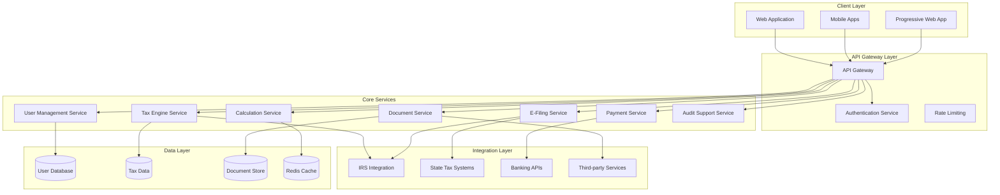

# Tax Preparation Application Design Document

## Overview

The tax preparation application will be built as a modern, cloud-native platform using a microservices architecture to ensure scalability, security, and compliance with tax regulations. The system will provide a comprehensive suite of tax preparation tools accessible through web and mobile interfaces, with real-time calculations, intelligent deduction optimization, and seamless integration with IRS and state tax systems.

## Architecture

### High-Level Architecture



### Technology Stack

**Frontend:**
- React.js with TypeScript for web application
- React Native for mobile applications
- Progressive Web App capabilities for offline access
- Material-UI/Chakra UI for consistent design system

**Backend:**
- Node.js with Express.js for API services
- Python for tax calculation engine and ML components
- PostgreSQL for relational data storage
- MongoDB for document storage
- Redis for caching and session management

**Infrastructure:**
- AWS/Azure cloud platform
- Docker containers with Kubernetes orchestration
- CDN for global content delivery
- Load balancers for high availability

**Security:**
- OAuth 2.0 + JWT for authentication
- AES-256 encryption for data at rest
- TLS 1.3 for data in transit
- AWS KMS for key management
- SOC 2 Type II compliance framework

## Components and Interfaces

### 1. User Management Service

**Responsibilities:**
- User registration and authentication
- Profile management and preferences
- Multi-factor authentication
- Session management and security

**Key Interfaces:**
```typescript
interface UserService {
  registerUser(userData: UserRegistration): Promise<User>
  authenticateUser(credentials: LoginCredentials): Promise<AuthToken>
  setupMFA(userId: string, method: MFAMethod): Promise<MFASetup>
  updateProfile(userId: string, updates: ProfileUpdate): Promise<User>
  deactivateUser(userId: string): Promise<void>
}
```

### 2. Tax Engine Service

**Responsibilities:**
- Tax form management and validation
- Real-time tax calculations
- Deduction optimization algorithms
- Tax law compliance and updates

**Key Interfaces:**
```typescript
interface TaxEngine {
  calculateTax(taxData: TaxReturn): Promise<TaxCalculation>
  validateForm(formData: TaxForm): Promise<ValidationResult>
  optimizeDeductions(income: IncomeData, expenses: ExpenseData): Promise<DeductionRecommendations>
  updateTaxLaws(year: number): Promise<TaxLawUpdate>
  generateForms(taxReturn: TaxReturn): Promise<TaxForms>
}
```

### 3. Document Service

**Responsibilities:**
- Document upload and storage
- OCR and data extraction
- Document categorization and organization
- Audit trail maintenance

**Key Interfaces:**
```typescript
interface DocumentService {
  uploadDocument(file: File, userId: string): Promise<Document>
  extractData(documentId: string): Promise<ExtractedData>
  categorizeDocument(documentId: string): Promise<DocumentCategory>
  getDocuments(userId: string, filters: DocumentFilters): Promise<Document[]>
  generateAuditTrail(userId: string): Promise<AuditTrail>
}
```

### 4. E-Filing Service

**Responsibilities:**
- IRS and state tax system integration
- Electronic filing submission
- Filing status tracking
- Error handling and resubmission

**Key Interfaces:**
```typescript
interface EFilingService {
  submitFederalReturn(taxReturn: TaxReturn): Promise<FilingResult>
  submitStateReturn(stateReturn: StateReturn): Promise<FilingResult>
  checkFilingStatus(submissionId: string): Promise<FilingStatus>
  handleRejection(rejectionData: RejectionData): Promise<CorrectionGuidance>
  trackRefund(ssn: string, refundAmount: number): Promise<RefundStatus>
}
```

### 5. Payment Service

**Responsibilities:**
- Tax payment processing
- Refund management
- Payment plan setup
- Transaction security and compliance

**Key Interfaces:**
```typescript
interface PaymentService {
  processPayment(paymentData: PaymentRequest): Promise<PaymentResult>
  setupPaymentPlan(planData: PaymentPlan): Promise<PaymentPlanResult>
  processRefund(refundData: RefundRequest): Promise<RefundResult>
  getTransactionHistory(userId: string): Promise<Transaction[]>
  validatePaymentMethod(paymentMethod: PaymentMethod): Promise<ValidationResult>
}
```

## Data Models

### Core Data Models

```typescript
// User and Authentication
interface User {
  id: string
  email: string
  profile: UserProfile
  securitySettings: SecuritySettings
  createdAt: Date
  lastLogin: Date
}

interface UserProfile {
  firstName: string
  lastName: string
  ssn: string // encrypted
  dateOfBirth: Date
  address: Address
  filingStatus: FilingStatus
}

// Tax Return Data
interface TaxReturn {
  id: string
  userId: string
  taxYear: number
  filingStatus: FilingStatus
  income: IncomeData
  deductions: DeductionData
  credits: CreditData
  calculations: TaxCalculation
  forms: TaxForm[]
  status: ReturnStatus
  createdAt: Date
  lastModified: Date
}

interface IncomeData {
  wages: WageIncome[]
  selfEmployment: SelfEmploymentIncome[]
  investment: InvestmentIncome[]
  retirement: RetirementIncome[]
  other: OtherIncome[]
}

interface DeductionData {
  standardDeduction: number
  itemizedDeductions: ItemizedDeduction[]
  businessDeductions: BusinessDeduction[]
  recommendedDeductions: DeductionRecommendation[]
}

// Document Management
interface Document {
  id: string
  userId: string
  fileName: string
  fileType: string
  category: DocumentCategory
  extractedData: ExtractedData
  uploadDate: Date
  taxYear: number
  isVerified: boolean
}

// Filing and Payments
interface FilingResult {
  submissionId: string
  status: FilingStatus
  confirmationNumber?: string
  errors?: FilingError[]
  estimatedProcessingTime: number
}

interface PaymentTransaction {
  id: string
  userId: string
  amount: number
  paymentMethod: PaymentMethod
  status: PaymentStatus
  transactionDate: Date
  confirmationNumber: string
}
```

## Error Handling

### Error Classification and Response Strategy

**1. User Input Errors**
- Validation errors with specific field guidance
- Real-time validation feedback
- Progressive disclosure of error details
- Suggested corrections and examples

**2. System Errors**
- Graceful degradation for service outages
- Retry mechanisms with exponential backoff
- Circuit breaker patterns for external services
- Comprehensive error logging and monitoring

**3. Compliance Errors**
- Tax law validation with detailed explanations
- IRS rejection handling with correction guidance
- Audit flag warnings with documentation requirements
- Professional advisor escalation options

**4. Security Errors**
- Authentication failures with account protection
- Suspicious activity detection and response
- Data breach protocols and user notification
- Compliance violation reporting and remediation

### Error Response Format

```typescript
interface ErrorResponse {
  code: string
  message: string
  details?: ErrorDetail[]
  suggestions?: string[]
  documentationUrl?: string
  supportContact?: ContactInfo
}

interface ErrorDetail {
  field?: string
  constraint: string
  currentValue?: any
  expectedFormat?: string
}
```

## Testing Strategy

### 1. Unit Testing
- **Coverage Target**: 90% code coverage for all services
- **Framework**: Jest for JavaScript/TypeScript, pytest for Python
- **Focus Areas**: Tax calculations, validation logic, data transformations
- **Mocking**: External API calls, database operations, file system operations

### 2. Integration Testing
- **API Testing**: Comprehensive REST API endpoint testing
- **Database Testing**: Data persistence and retrieval validation
- **External Service Testing**: IRS and state system integration testing
- **Payment Processing**: Secure payment flow validation

### 3. End-to-End Testing
- **User Journey Testing**: Complete tax preparation workflows
- **Cross-Platform Testing**: Web and mobile application consistency
- **Filing Process Testing**: Full e-filing simulation with test environments
- **Security Testing**: Authentication, authorization, and data protection

### 4. Performance Testing
- **Load Testing**: Concurrent user capacity during tax season
- **Stress Testing**: System behavior under extreme load
- **Calculation Performance**: Tax engine response time optimization
- **Database Performance**: Query optimization and indexing validation

### 5. Security Testing
- **Penetration Testing**: Regular security vulnerability assessments
- **Compliance Testing**: SOC 2 and IRS security requirement validation
- **Data Encryption Testing**: End-to-end encryption verification
- **Access Control Testing**: Role-based permission validation

### 6. Compliance Testing
- **Tax Law Accuracy**: Validation against IRS publications and updates
- **Form Generation**: Accurate PDF form creation and validation
- **Calculation Verification**: Cross-validation with official tax software
- **Audit Trail Testing**: Complete transaction and change logging

### Testing Automation Strategy

```typescript
// Example test structure for tax calculations
describe('Tax Calculation Engine', () => {
  describe('Standard Deduction Calculation', () => {
    it('should calculate correct standard deduction for single filer 2024', () => {
      const result = calculateStandardDeduction('single', 2024)
      expect(result).toBe(14600)
    })
    
    it('should calculate correct standard deduction for married filing jointly 2024', () => {
      const result = calculateStandardDeduction('marriedFilingJointly', 2024)
      expect(result).toBe(29200)
    })
  })
  
  describe('Tax Liability Calculation', () => {
    it('should calculate correct tax for various income brackets', () => {
      const testCases = [
        { income: 50000, filingStatus: 'single', expectedTax: 6617 },
        { income: 100000, filingStatus: 'marriedFilingJointly', expectedTax: 11434 }
      ]
      
      testCases.forEach(testCase => {
        const result = calculateTaxLiability(testCase.income, testCase.filingStatus)
        expect(result).toBeCloseTo(testCase.expectedTax, 0)
      })
    })
  })
})
```

### Continuous Integration Pipeline

1. **Code Quality Gates**: ESLint, Prettier, SonarQube analysis
2. **Automated Testing**: Unit, integration, and security tests
3. **Performance Benchmarks**: Response time and throughput validation
4. **Compliance Checks**: Tax law accuracy and regulatory compliance
5. **Security Scans**: Dependency vulnerabilities and code security analysis
6. **Deployment Validation**: Staging environment verification before production

This comprehensive testing strategy ensures the tax preparation application meets the highest standards for accuracy, security, and user experience while maintaining compliance with all relevant regulations and tax laws.